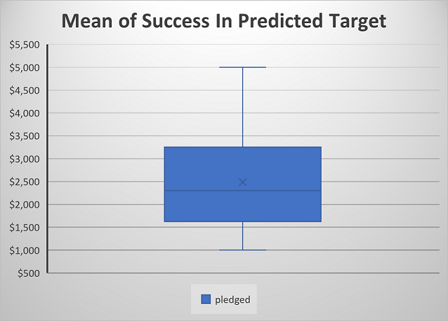

# Kickstarting with Excel
    Keith Rabb 281-513-5996 keithrabb@icloud.com
## Overview of Project
    Louise is interested in know how other kickstarter projects did with respect to launch dates and funding goals.
### Purpose 
    To visualize campaign outcomes based on their launch dates and funding goals
## Analysis and Challenges

### Analysis of Outcomes Based on Launch Date

### Analysis of Outcomes Based on Goals

### Challenges and Difficulties Encountered
    The requested ranges are very broad when trying to narrow down "best chance for success" to gain funding for for future projects.
        1 Establish a smaller range withing the range of the overall scope.
        2 Establish a reasonable target amount to expect for future crowdfunding a project
The below chart shows that within the range of $1k to $5k, just under $2500 is the mean.  This gives the client an advantage when trying to forecast future play budgets if financed threw a crowdfunding campaign

    
## Results

- What are two conclusions you can draw about the Outcomes based on Launch Date?

- What can you conclude about the Outcomes based on Goals?

- What are some limitations of this dataset?

- What are some other possible tables and/or graphs that we could create?
